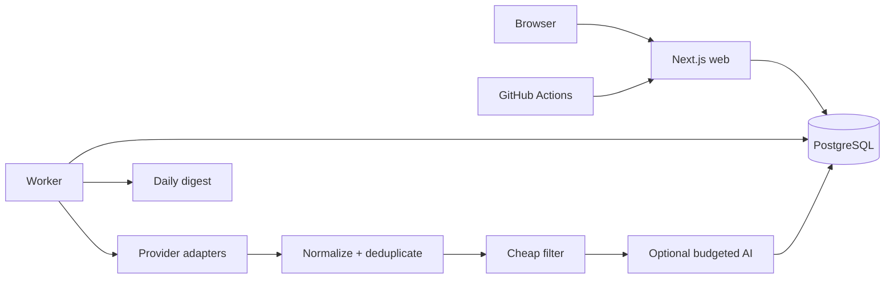

# Élan

Élan is a private, self-hosted recruiting agent for job seekers in France. It discovers real vacancies from configured official/public sources, merges duplicate postings, filters them against a reviewed candidate profile, optionally evaluates likely matches with a bounded AI budget, and keeps application history in one responsive dashboard.

The production architecture uses a Next.js web service, a separate durable worker and PostgreSQL. Railway can run both services from the same repository. GitHub Actions queues the daily job search, so no personal computer needs to stay online.

## What is implemented

- Single-owner setup and login with scrypt password hashing, revocable hashed sessions, HTTP-only cookies and same-origin write checks.
- Reviewed candidate profile, immutable uploaded resume records and AI extraction suggestions that never save themselves.
- Multiple focused search profiles with bounded reusable queries.
- Canonical jobs with multiple source records, URL/source identity checks, company/title/location hashes and description fingerprints.
- Official/public Greenhouse, Lever, Ashby and France Travail adapters, plus explicit allowlisted schema.org company pages with SSRF and robots controls.
- Explicitly unavailable LinkedIn, Indeed France, HelloWork, Jobijoba, Apec, Welcome to the Jungle and Cadremploi entries. Élan does not circumvent their access controls or current automated-extraction restrictions.
- Deterministic prefiltering before schema-validated OpenAI, Anthropic, Gemini or OpenRouter analysis. No AI call occurs without an explicit model, key, exact price inputs and daily limits.
- Job filters, evidence-rich detail pages, manual import, application Kanban/history, CV-tailoring suggestions and French/English cover letters with Markdown, HTML and PDF exports.
- PostgreSQL task leases with ownership tokens, retry/backoff and recovery; provider failures remain isolated.
- One idempotent daily email/Telegram digest, provider health, search-run history, structured logs and personal-data export/deletion.

The app starts empty. It contains no fake production vacancies.

## Architecture



See [Architecture](docs/ARCHITECTURE.md), [implementation plan](docs/IMPLEMENTATION_PLAN.md), [provider matrix](docs/PROVIDER_MATRIX.md), [reference review](docs/REFERENCES.md), [API contract](docs/API_CONTRACT.md), and [provider guide](docs/ADDING_PROVIDER.md).

## Technology

Next.js 15 App Router, React 19, strict TypeScript, Tailwind CSS 4, Prisma 6, PostgreSQL 16, Zod 4 and a TypeScript worker. Redis and paid scraping services are unnecessary for the first production deployment.

## Quick start

Requirements: Node.js 22 and PostgreSQL 16.

```bash
cp .env.example .env
npm install
npm run db:migrate
npm run dev
```

In a second terminal, run the durable worker:

```bash
npm run worker
```

Open `http://localhost:3000`. The first account requires the `SETUP_SECRET` from `.env`. Use a unique password of at least 12 characters. Then complete the candidate profile, create a search profile, configure a provider and select **Run job search**.

## Environment variables

Required variables are `DATABASE_URL`, `APP_URL`, `NEXTAUTH_SECRET` (32+ random characters), `SETUP_SECRET` (16+ characters) and a distinct `JOB_RUNNER_SECRET` (24+ characters).

AI is optional. Configure `AI_PROVIDER`, `AI_MODEL`, the matching provider key, and both `AI_INPUT_PRICE_PER_MILLION` and `AI_OUTPUT_PRICE_PER_MILLION`. Price values must match the exact model and are deliberately not hardcoded because prices change. `AI_FALLBACK_MODEL` is optional. App reservations complement the provider account's own spend limit.

France Travail requires `FRANCE_TRAVAIL_CLIENT_ID` and `FRANCE_TRAVAIL_CLIENT_SECRET` from its partner API portal. ATS provider board slugs are configured in the dashboard and are not secrets.

Email supports Resend (`RESEND_API_KEY`) or `SMTP_URL`; both need `EMAIL_FROM` and `DIGEST_TO`. Telegram needs `TELEGRAM_BOT_TOKEN` and `TELEGRAM_CHAT_ID`. Notification toggles remain off until explicitly enabled in Settings. Firecrawl, ScraperAPI and Apify keys are reserved in `.env.example`; no current code path uses or sends them.

Cost controls default to 30 AI requests, USD 2, 50 jobs per provider and 200 jobs per run. See `.env.example` for every limit.

## Providers and scraping strategy

Greenhouse, Lever and Ashby use documented public job-board endpoints. France Travail uses its official OAuth API. The generic adapter only reads user-configured HTTPS pages with schema.org `JobPosting`, checks every hostname/redirect against an allowlist, rejects private IP ranges, limits response size and observes robots rules.

Élan does not store LinkedIn credentials or authentication cookies. It does not bypass CAPTCHAs, blocks or rate limits. A blocked or changed source records a classified health failure while other providers continue. Read [the current matrix](docs/PROVIDER_MATRIX.md) before enabling or extending a source; provider terms and APIs can change.

## AI behavior

Deterministic filters check exclusions, title, skills, location, work style, contract and stated salary before any model request. Candidate JSON and job text are supplied as separate data blocks under a no-tools system instruction. Output must pass a strict schema. Matching and transferable skills are then limited to skills already stored in the candidate profile. Analyses are cached by profile version and job content fingerprint.

Resume extraction creates review suggestions. CV tailoring and cover letters may reorder or restate stored evidence, but must not invent experience, education, skills, achievements or numbers. Users should review every generated document.

## Docker

The Dockerfile has separate non-root `web` and `worker` targets:

```bash
docker build --target web -t elan-web .
docker build --target worker -t elan-worker .
```

Both need the same environment and PostgreSQL. The web target reads Railway's `PORT`; the worker exposes no HTTP port.

## Railway deployment

1. Push this repository to GitHub.
2. Create a Railway project and add PostgreSQL.
3. Add a web service from the repository. `railway.json` selects the `web` Docker target and `/api/health`.
4. Add the required environment variables. Set `DATABASE_URL` from the PostgreSQL service and `APP_URL` to the final HTTPS domain.
5. The `web` and `worker` images run `prisma migrate deploy` before starting, so committed migrations are applied automatically against the configured Neon `DATABASE_URL`. If you prefer a manual first migration, run `npm run db:migrate` locally with the Neon URL before deploying.
6. Add a second service from the same repository. Point its config file at `railway.worker.json`, or set Docker target `worker` and start command `sh -c './node_modules/.bin/prisma migrate deploy && exec ./node_modules/.bin/tsx workers/main.ts'`.
7. Deploy both services and verify `/api/health`, initial owner setup and that the worker is running.
8. Add GitHub Actions secrets `APP_URL` and `JOB_RUNNER_SECRET`.
9. Run **Daily job search** with `workflow_dispatch`, then verify the queued run and provider health in the dashboard.

The daily workflow runs at 05:17 UTC. That is 06:17 in Paris in winter and 07:17 in summer. GitHub cron uses UTC and may start later during busy periods. If a constant Paris wall-clock time is essential, use two seasonal UTC schedules plus a timezone guard, or a Railway scheduler with explicit timezone support.

Connecting GitHub and creating Railway resources require your account; this repository prepares those deployment artifacts but does not claim that an external deployment already exists.

## Testing

```bash
npm run lint
npm run typecheck
npm test
npm run build
```

Unit tests use synthetic, offline fixtures. PostgreSQL integration checks run in CI against a temporary service. Live provider smoke tests should be infrequent, bounded and executed only after reviewing current source terms.

## Screenshots

Screenshots can be added here after the first deployed environment is populated with the owner's private search data. The repository does not ship synthetic jobs or fabricated dashboard results.

## Troubleshooting

- A run stays queued: ensure the worker service uses the same `DATABASE_URL` and inspect its structured logs.
- A provider is degraded with no jobs: verify its board slug/credentials, query terms and recorded extraction statistics. Zero results are not replaced with sample data.
- AI remains disabled: provide a model, its key and both exact token prices. Check the provider account's own budget and rate limit.
- The daily workflow receives 401: make the GitHub `JOB_RUNNER_SECRET` exactly match Railway.
- Migration fails: verify the Railway PostgreSQL URL and run committed migrations before the new web process starts.

## Privacy and responsible operation

Candidate data, resumes, analysis and application history require authentication. Secrets and CV contents are excluded from structured logs. The Privacy panel exports personal records and can delete the owner account and all related private data. Jobs are retained when sources disappear and application-related records remain until the owner deletes their data.

The operator is responsible for source terms, robots policies, rate limits and applicable French/EU law. Collect only public vacancy information needed for a personal search, avoid unnecessary recruiter personal data and disable any source whose permitted access becomes unclear.

## License

Copyright 2026. Released under the MIT License; see `LICENSE`. Reference projects were studied as documented in `docs/REFERENCES.md`. No third-party source code was copied.
