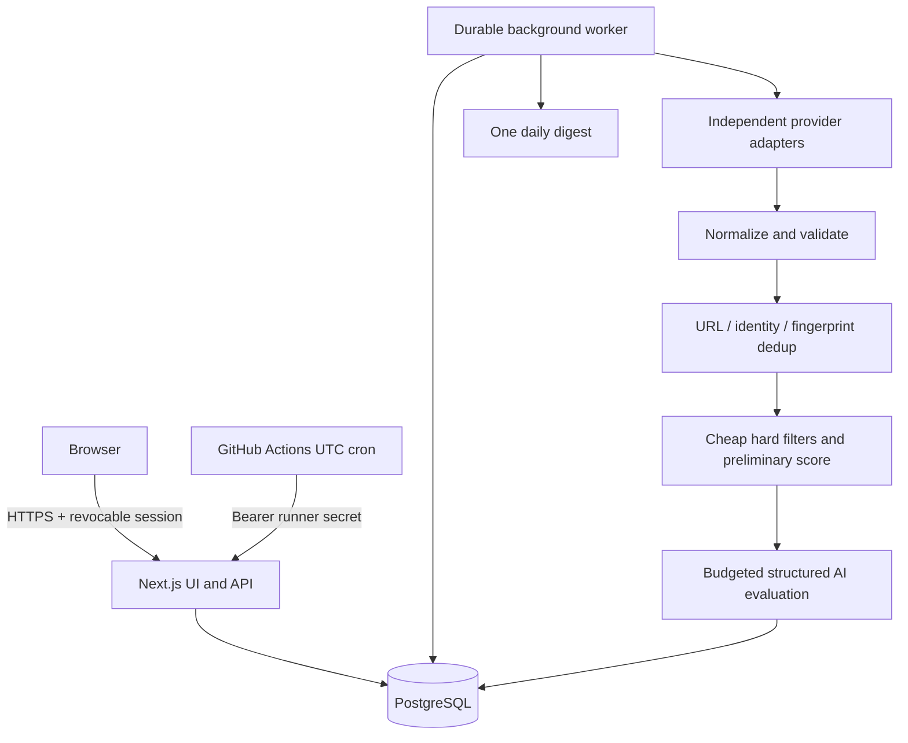

# Architecture

A personal, single-account Next.js application and a separate Node.js worker share PostgreSQL. Railway runs both processes online. The browser never receives AI/provider credentials. Next.js route handlers authenticate every private request, validate input with Zod and call services using Prisma. There is no request-time scraper execution.

## Boundaries

- `app`, `components`: accessible server/client rendering and route handlers.
- `lib/schemas.ts`: validated candidate/search/job contracts shared by services.
- `lib/services`: persistence, search orchestration, immutable resume review, application history, budget and notification policy.
- `providers`: adapters and extraction strategies; no user, database or ranking logic.
- `ai`: provider transport, structured schemas, untrusted-content isolation and grounding checks.
- `matching`, `deduplication`: deterministic pure functions before paid semantic evaluation.
- `workers`: PostgreSQL task claim/retry/lease processing independent of web lifecycle.

## Reliability

Task claims use PostgreSQL `FOR UPDATE SKIP LOCKED`. Leases have ownership tokens: stale workers cannot complete or retry tasks claimed by a replacement. Heartbeats renew leases; hard deadlines stop hung work. Stages are bounded and safe to retry. A partial unique index permits only one queued/running SearchRun. Jobs and posting sources have uniqueness constraints. Provider exceptions are recorded individually; a run completes even if a provider fails. AI errors leave collected jobs intact and retriable. Digest identity is recipient/channel/local calendar day; delivery uncertainty is surfaced instead of promising exactly-once email delivery.

## Data and scoring

CandidateProfile and SearchProfile are separate; profile version and job content hashes key analyses. A canonical Job owns multiple JobPostingSource records. The application tracker belongs to the canonical record and survives a source disappearance. No scheduled deletion of application jobs. Optional salary data never becomes zero or invented compensation. Only likely matches pass to schema-validated evaluation, and deterministic hard blockers cannot be overridden by an LLM. Candidate facts and untrusted job text are separate data in a no-tools AI request; inferred CV fields require explicit review.

## Security and cost

Personal-account setup requires a deployment bootstrap secret. Passwords use scrypt and sessions use random tokens stored only as hashes. Same-origin mutation checks, HTTP-only secure cookies in production, rate limits and service-level authentication protect API routes. Arbitrary fetches validate protocol, DNS/private ranges and every redirect, with bounded bodies and timeouts. Scraped markup is converted to inert plain text; documents are never executed. Uploads are size/type/magic checked and parsed in a bounded subprocess. Secrets and CVs are not logged.

Daily usage reservations occur under a database lock before each model request, including retries and document generation. Explicit model price configuration determines conservative reservations; unknown pricing disables paid calls. The user configures a model and key. Limits are application estimates and complement provider-account billing limits.

## Deployment

A multi-stage Docker build produces a non-root image. Run the web service with Railway PORT and a distinct worker service from the same image. Run committed Prisma migrations once before web deployment. PostgreSQL retains all durable state. GitHub Actions calls `/api/internal/jobs/run` using JOB_RUNNER_SECRET and an idempotency key. Daily cron is expressed in UTC; Europe/Paris is UTC+1 in winter and UTC+2 in summer. See README for operations and verified delivery status.
